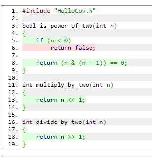
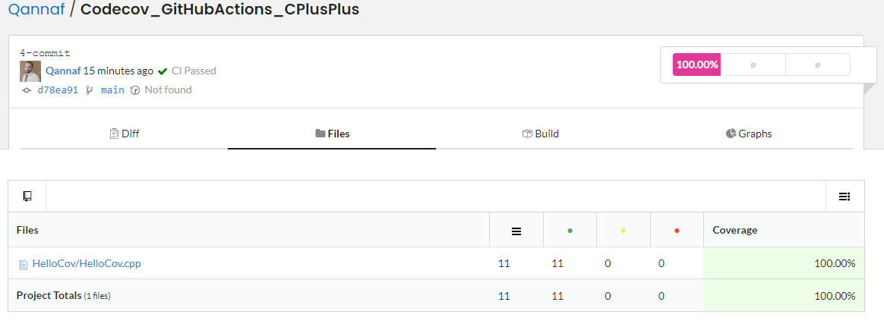
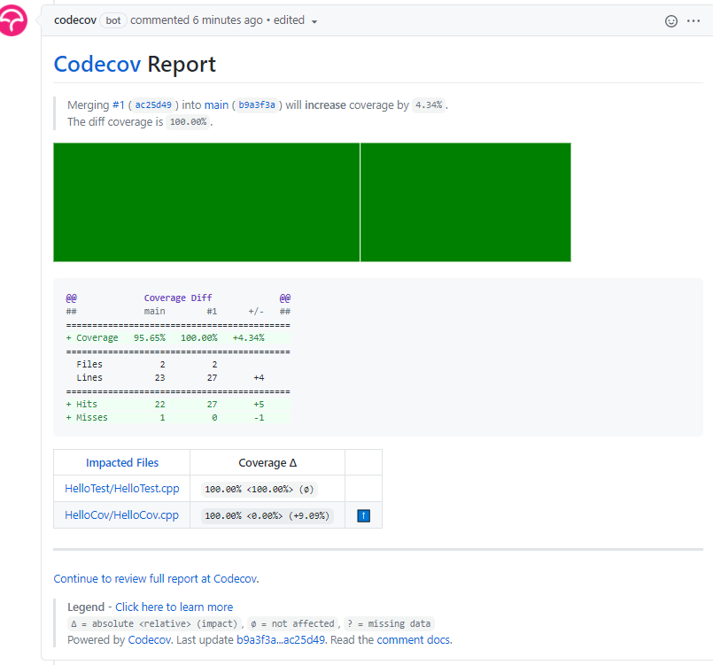

## Codecov with C++ and GitHub Actions
 

    
                

Tests are an important component of software development: they help prevent bugs and can act as documentation. One of the best ways to ensure your code quality stays high over time is to monitor your test coverage, through a measure known as code coverage. Monitoring code coverage is essential to maintaining code quality, and there are many tools out there that can assist with this.

<a href="https://github.com/OpenCppCoverage/OpenCppCoverage">OpenCppCoverage</a>&nbsp;is an open-source C++ code coverage tool for Windows that can generate coverage reports locally, and then leverage Codecov GitHub Actions to integrate coverage reports in your CI pipeline.

In this tutorial, you will learn the basics of OpenCppCoverage and how to integrate it into your CI pipeline. If you’d like to skip ahead to the full code for the demo, it is available&nbsp;<a href="https://github.com/Qannaf/Codecov_GitHubActions_CPlusPlus.git">here</a>.

<h2 id="running-tests-and-coverage-locally">Running Tests and Coverage Locally</h2>

To follow this tutorial, you need Windows Vista or higher and Microsoft Visual Studio 2008 or higher. You can clone the demo repository with the following command:

<pre><code class="lang-Git">git clone https://github.com/Qannaf/Codecov_GitHubActions_CPlusPlus.git
</code></pre>

Alternatively, you can proceed with the step-by-step instructions below.

<h3 id="1-creating-a-library">1. Creating a Library</h3>

First, you will create a static library project from Visual Studio. The library will house computations below that can be performed with bit operations.

<pre><code class="lang-C++ hljs">// HelloCov.h
bool is_power_of_two(int n);
int multiply_by_two(int n);
int divide_by_two(int n);
</code></pre>
<pre><code class="lang-C++ hljs">//HelloCov.cpp
#include "HelloCov.h"

bool is_power_of_two(int n)
{
    if (n &lt; 0)
        return false;

    return (n &amp; (n - 1)) == 0;
}

int multiply_by_two(int n)
{
    return n &lt;&lt; 1;
}

int divide_by_two(int n)
{
    return n &gt;&gt; 1;
}
</code></pre>

Ensure the library compiles successfully, then proceed to add tests.

<h3 id="2-add-tests">2. Add Tests</h3>

In the same solution, add a&nbsp;<code>Native Unit Test Project</code>&nbsp;with reference to the&nbsp;<code>HelloCov</code>&nbsp;library. In a source file, add one test method for each function as follows:

<pre><code class="lang-C++ hljs">#include "CppUnitTest.h"
#include "../HelloCov/HelloCov.h"

using namespace Microsoft::VisualStudio::CppUnitTestFramework;

namespace HelloCovTest
{
  TEST_CLASS(Test1)
  {
  public:

    TEST_METHOD(IsPowerOfTwo)
    {
      Assert::IsTrue(is_power_of_two(8));
    }

    TEST_METHOD(MultiplyByTwo)
    {
      Assert::AreEqual(14, multiply_by_two(7));
    }

    TEST_METHOD(DivideByTwo)
    {
      Assert::AreEqual(-4, divide_by_two(-7));
    }
  };
}
</code></pre>

Verify that all the tests pass.

<h3 id="3-install-opencppcoverage">3. Install OpenCppCoverage</h3>

There are two ways to install it—using&nbsp;<a href="https://chocolatey.org/">Chocolatey</a>:

<pre><code class="lang-cmd hljs dos">choco install opencppcoverage
</code></pre>

Or using the interactive installer. Go to&nbsp;<a href="https://github.com/OpenCppCoverage/OpenCppCoverage/releases">releases</a>&nbsp;and download the latest release of the installer.

<h3 id="4-generate-code-coverage-report">4. Generate Code Coverage Report</h3>

From the root directory of the solution, run the following command:

<pre><code class="lang-cmd hljs dos">OpenCppCoverage --sources HelloCov -- "C:\Program Files (x86)\Microsoft Visual Studio\2019\Community\Common7\IDE\CommonExtensions\Microsoft\TestWindow\vstest.console.exe" debug/HelloTest.dll
</code></pre>

The path of&nbsp;<code>vstest.console.exe</code>&nbsp;depends on your version of Visual Studio, so update it accordingly. The report will be generated in the folder&nbsp;<code>CodeCoverage-&lt;Timestamp&gt;</code>. You can view it by opening&nbsp;<code>index.html</code>&nbsp;in a browser. On navigating to the report for&nbsp;<code>HelloTest.dll</code>&nbsp;&gt;&nbsp;<code>HelloCov.cpp</code>, you will see the line coverage like below:

<h2 id="configuring-github-actions">Configuring GitHub Actions</h2>

Coverage reports are most useful when making changes to your code. In this section, you will integrate Codecov into your workflow so that you are able to view reports on pull requests or pushes to your repo.

<h3 id="1-repo">1. Repo</h3>

Create a public GitHub and push to it the solution above.

<h3 id="2-sign-up-for-codecov">2. Sign Up for Codecov</h3>

If you don’t already have an account, head over to&nbsp;<a href="https://about.codecov.io/">Codecov</a>&nbsp;and sign up with your GitHub account. Select the repo you will be integrating. This tutorial uses a public repo for simplicity but if your repo is private you will be provided a token. Alternatively, you can add a repo by navigating to&nbsp;<code>https://app.codecov.io/gh/&lt;gh-username&gt;/&lt;repo-name&gt;</code>.

<h3 id="3-setup-github-actions">3. Setup GitHub Actions</h3>

<a href="https://github.com/features/actions">GitHub Actions</a>&nbsp;make it easy to automate software workflows. You’ll set up a workflow to essentially run OpenCppCoverage on a Windows machine, then upload the report to CodeCov. These actions are specified in a YAML file in the&nbsp;<code>.github/workflows</code>&nbsp;directory in your repo. Add the YAML file below to your workflows folder:

<pre><code class="lang-yml hljs yaml">name: Upload CodeCov Report
on: [push, pull_request]
jobs:
  run:
    runs-on: windows-latest
    name: Build, Test , Upload Code Coverage Report
    steps:
      - name: Checkout code
        uses: actions/checkout@v2
        with:
          fetch-depth: ‘2’
        id: checkout_code
      - name: Setup MSBuild and add to PATH
        uses: microsoft/setup-msbuild@v1.0.2
        id: setup_msbuild
      - name: Run MSBuild
        id: run_msbuild
        run: msbuild /p:Configuration=Debug /p:Platform=x86 HelloCovDemo.sln
      - name: Setup VSTest and add to PATH
        uses: darenm/Setup-VSTest@v1
        id: setup_vstest
      - name: Setup OpenCppCoverage and add to PATh
        id: setup_opencppcoverage
        run: |
          choco install OpenCppCoverage -y
          echo "C:\Program Files\OpenCppCoverage" &gt;&gt; $env:GITHUB_PATH
      - name: Generate Report
        id: generate_test_report
        shell: cmd
        run: OpenCppCoverage.exe --sources HelloCov --export_type cobertura:HelloCov.xml -- "vstest.console.exe" Debug\HelloTest.dll
      - name: Upload Report to Codecov
        uses: codecov/codecov-action@v1.3.2
        with:
          files: ./HelloCov.xml
          fail_ci_if_error: true
          functionalities: fix
</code></pre>

The actions are described by their respective&nbsp;<code>name</code>&nbsp;properties. They mirror what we manually did to generate local reports i.e setup, build, test,k and coverage. Of importance are the last two actions that generate and upload the report. The&nbsp;<code>OpenCppCoverage</code>&nbsp;command is similar to the one used locally, and the&nbsp;<code>export_type</code>&nbsp;parameter is added to get the report in xml, one of the Codecov supported formats. The absolute path of vstest is not required since&nbsp;<code>setup_vstest</code>&nbsp;action added it to global PATH. When you push this change you can monitor the workflow from the Actions tab of the repo on GitHub.

<h3 id="4-view-codecov-report">4. View Codecov Report</h3>

If the workflow succeeds, at the end of logs for the upload action, there will be a link to the Codecov report like below:

Navigate to the link for a detailed report including the conspicuous coverage percentage. Under the Files tab, you can view line-by-line coverage for each file.

Under the Graphs tab, you can view graphical representations of your coverage, like the sunburst below:

<a href="https://docs.codecov.io/docs/graphs#sunburst">Sunburst graphs</a>&nbsp;enable you to navigate into project folders in order to discover files that lack coverage. The size of each slice is proportional to the number of coverage lines and the color indicates coverage. Click on a block to enter a folder and click the innermost circle to leave it.

<h3 id="5-change-report">5. Change Report</h3>

To view coverage reports as comments on pull requests, set up as follows:

<ul>
<li>Add empty&nbsp;<code>codecov.yml</code>&nbsp;to the root of the repo.</li>
<li>Grant access to the&nbsp;<a href="https://github.com/marketplace/codecov">codecov bot</a>&nbsp;to your account.To verify the setup, on a separate branch, write tests to cover the lines that have not been covered:</li>
</ul>
<pre><code class="lang-C++ hljs">TEST_METHOD(IsNegativePowerOfTwo)
{
    Assert::IsFalse(is_power_of_two(-8));
}
</code></pre>

Push and create a pull request from the branch. You should see a report like below on the pull request when the actions complete:

Observe that coverage increases as expected.

<h2 id="conclusion">Conclusion</h2>

Code coverage is vital to ensuring that your software quality stays consistent over time. Now you should have a good grasp of how to integrate C++ code coverage reports in your CI workflows with Codecov in order to ensure you won’t fall behind on your coverage.

Although the tutorial was specifically for Windows, Codecov is platform-agnostic and can be configured not only with other C++ toolchains but also other languages and code-hosting platforms.

